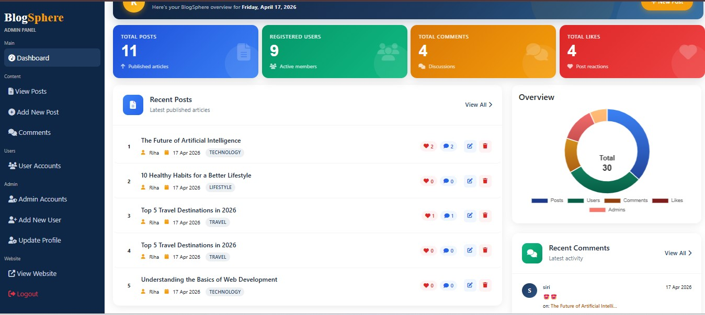
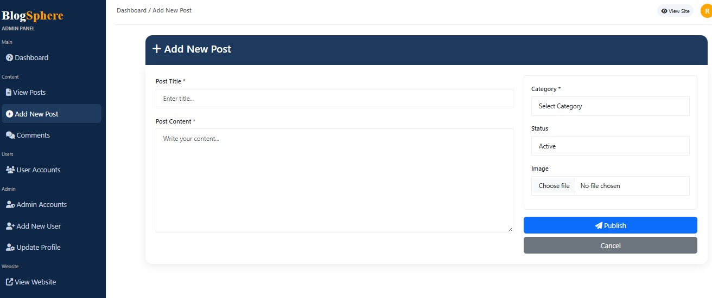
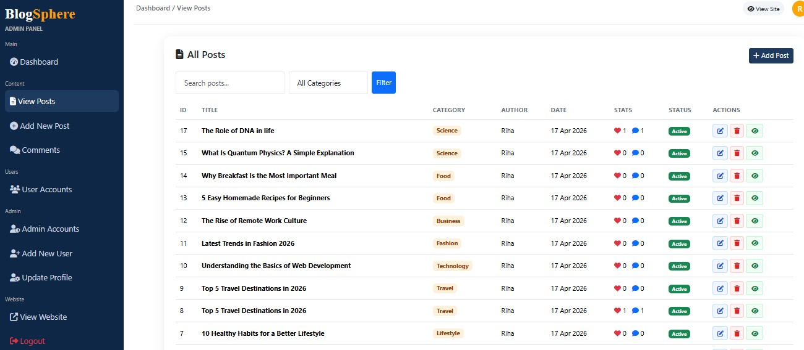
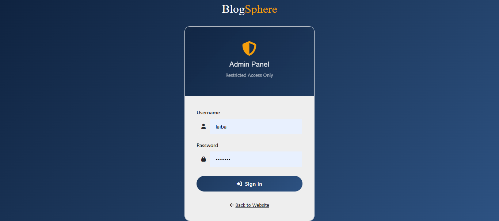
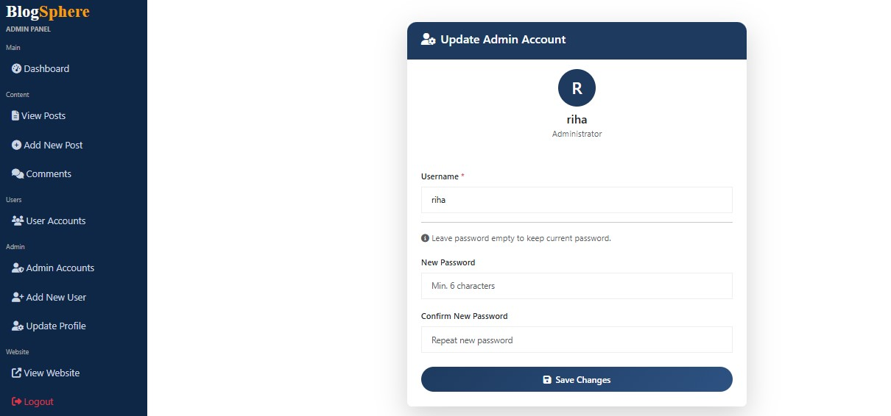
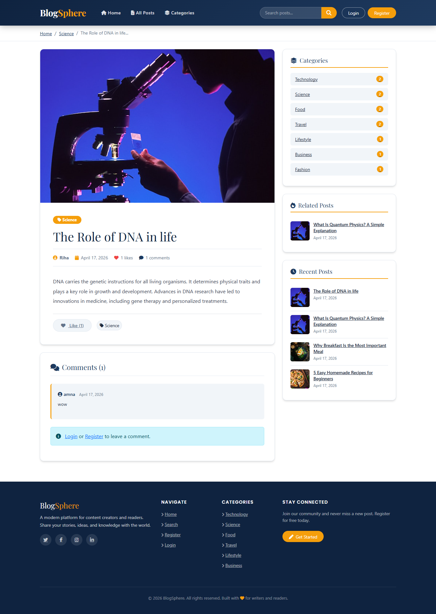
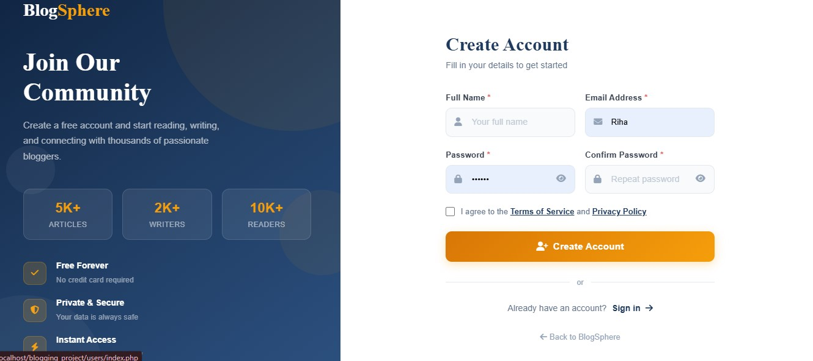

# 🚀 PHP Blogging CMS with Advanced Admin Dashboard

A complete *Blogging Content Management System (CMS)* built using *PHP & MySQL, featuring a powerful **Admin Dashboard*, real-time analytics, and full user/post management.

---

## 📌 🔗 Demo

🎥 *Watch Full Project Demo:*
👉 https://youtu.be/5vjn0xql4mw

---

## ✨ Key Features

### 👤 User Panel

* 🏠 Browse all blog posts
* 📂 Category-based filtering
* 🔍 Search functionality
* 📝 View detailed posts
* ❤️ Like posts
* 👤 User registration & login
* ⚙️ Profile management

---

### 🛠️ Admin Panel

* 📊 Interactive Dashboard with *Donut Chart*
* 📦 Real-time statistics:

  * Users 👥
  * Posts 📝
  * Likes ❤️
  * Comments 💬
* ➕ Add posts with images
* 👁️ View all posts
* ✏️ Edit posts
* ❌ Delete posts
* 👥 Manage users & admins
* 💬 Moderate comments
* 🔐 Admin authentication system

---

## 📸 Screenshots

---

## 🛠️ Tech Stack

* 💻 Frontend: HTML, CSS, JavaScript
* ⚙️ Backend: PHP
* 🗄️ Database: MySQL
* 📊 Charts: Chart.js
* 🎨 Styling: Bootstrap

---

## 📂 Project Structure

bash
project-root/
│
├── admin/
│   ├── add_posts.php
│   ├── admin_accounts.php
│   ├── admin_login.php
│   ├── comments.php
│   ├── dashboard.php
│   ├── edit_post.php
│   ├── read_post.php
│   ├── register_Admin.php
│   ├── update_profile.php
│   ├── users_accounts.php
│   └── view_posts.php
│
├── users/
│   ├── all_category.php
│   ├── category.php
│   ├── index.php
│   ├── login.php
│   ├── posts.php
│   ├── profile.php
│   ├── register.php
│   ├── search.php
│   ├── user_likes.php
│   └── view_posts.php
│
├── components/
│   ├── admin_header.php
│   ├── admin_logout.php
│   ├── connect.php
│   ├── user-header.php
│   ├── user-footer.php
│   └── user_logout.php
│
├── includes/
│   ├── auth.php
│   └── functions.php
│
├── css/
│   ├── admin_style.css
│   ├── auth.css
│   └── style.css
│
├── js/
│   ├── adminScript.js
│   └── script.js
│
├── uploaded_img/        # Stores uploaded post images
├── bootstrap/           # Bootstrap files
├── assets/              # Screenshots for README
│
└── (Main Entry Points)
    ├── index.php
    ├── login.php
    └── register.php

---

## ⚙️ Setup Instructions

1️⃣ Clone the repository

bash
git clone https://github.com/CodingWithLaiba/Blogging_website.git

2️⃣ Move project to XAMPP

C:/xampp/htdocs/

3️⃣ Start Apache & MySQL

4️⃣ Import database

* Open phpMyAdmin
* Create database
* Import SQL file

5️⃣ Run project

http://localhost/your-repo-name

---

## 🔐 Admin Access

/admin/admin_login.php

---

## 💡 Highlights

* 📊 Real-time dashboard analytics
* 🔄 Full CRUD operations
* 🔐 Secure authentication system
* 🧩 Modular PHP structure
* 📁 Clean folder organization

---

## 🚀 Future Enhancements

* 📱 Fully responsive design
* 🔔 Notifications system
* 📧 Email verification
* 🌐 Deployment (live hosting)

---

## 👩‍💻 Author

*Riha Shehzadi & Laiba Ijaz* 
Software Engineer | Frontend & Backend Developer

## 🤝 Collaboration

This project was developed as a collaborative effort.

- 👩‍💻 *Riha Shahzadi*  
  GitHub: https://github.com/codingwithriha  

- 👩‍💻 *Laiba Ijaz*
  
  GitHub: https://github.com/CodingWithLaiba
  
---

## ⭐ Show Your Support

If you like this project:

* ⭐ Star the repo
* 🍴 Fork it
* 📢 Share it

---
## 📬 Contact

Let’s connect and collaborate 🚀

---
